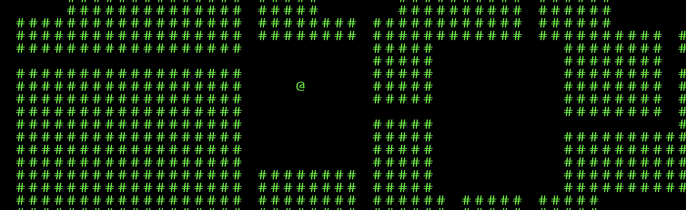

# THE ROOMS OF ROAMING
Minimal online exploration and sharing space

## CONCEPT
Rooms of Roaming is an interactive exploration space that is:
* **Open Ended** - new parts of the map are procedurally generated as users explore
* **Shared** - each user is exploring the same map, starting at the same spot
* **Collaborative** - as you wander away from the spawn, you are awarded with **Chalk Points** you can use this to **append characters to stone tablets scattered around the map**. You can leave some thoughts, questions for other projects, poetry, ascii art and whatever you can come up with using your limited characters count. Once put on the tablet, characters cannot be removed by anyone.
* **Minimal and meditative** - the map is rendered with ascii art on 2d grid with symbols for walls, your character and tablets. You don't see other players, only their words left on the stone tablets once you reach them. Your moving speed is restricted (one grid step every few seconds).

## CURRENT IMPLEMENTATION
* ✅ **Procedural dungeon generation** with room-based layouts and connecting corridors
* ✅ **Seamless chunk connectivity** - chunks connect perfectly at boundaries
* ✅ **Square character grid** with perfect centering and smooth movement
* ✅ **Debug mode** - Press Ctrl+D to visualize chunks and performance metrics
* ✅ **Real-time exploration** with WASD movement controls
* ✅ **Docker-based development** environment with hot-reload

## TECHNOLOGY STACK
* **Frontend** - React + TypeScript + Vite
* **Backend** - FastAPI + Python
* **Database** - PostgreSQL + Alembic migrations
* **Infrastructure** - Docker + Nginx reverse proxy

## GETTING STARTED
```bash
# Start the complete development environment
docker-compose up -d

# Visit the application
open http://localhost:3000

# Controls:
# - WASD or Arrow Keys: Move around
# - Ctrl+D: Toggle debug mode
# - I: View project info
```

## FEATURES
- 🏰 **Procedural Dungeons**: Each 48x48 chunk contains 3-8 rooms with corridors
- 🔗 **Connected World**: Boundary constraints ensure seamless chunk transitions  
- 🎯 **Perfect Grid**: Square characters with mathematical centering
- 🔍 **Debug Tools**: Chunk visualization with generation times and cache info
- ⚡ **Performance**: Deterministic generation with intelligent caching